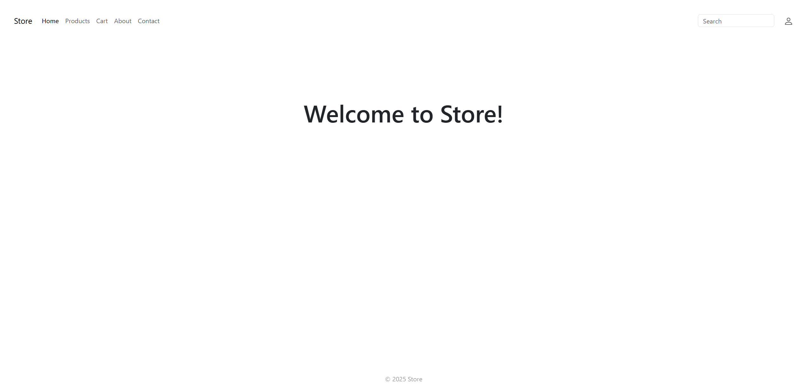
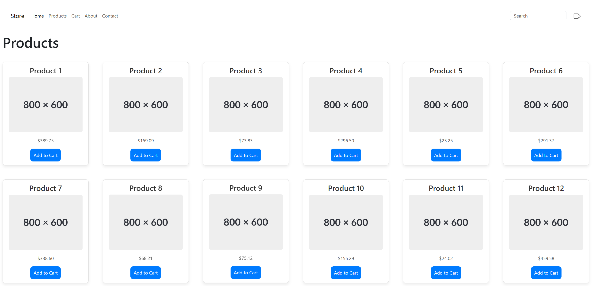
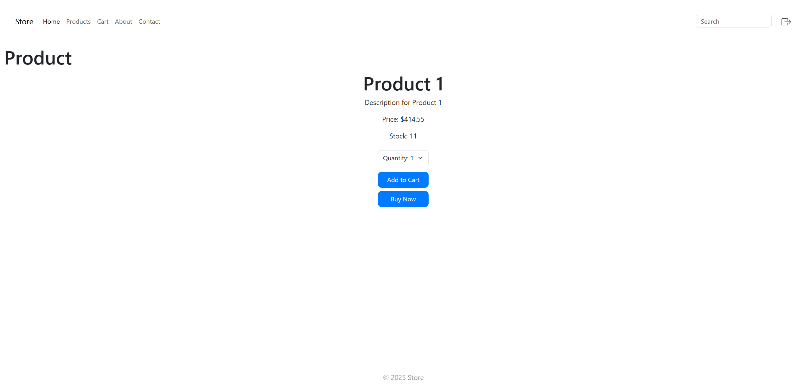
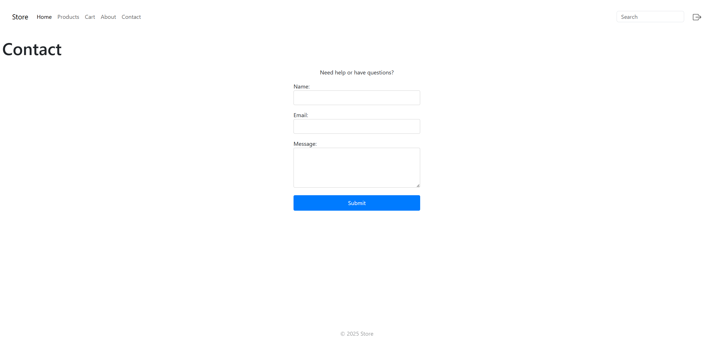

# Store


E-Commerce store built with Django. 

## Features
- Products Grid view
- Products Detail view
- Register user
- Login/Logout user
- Add products to cart
- Cart overview
- Checkout functionality (Missing actual payment/shipping process)











## Prerequisites:
- Python 3.13+
- `pip`

# Installation

### Clone
```bash
git clone https://github.com/lllDavid/store
```

### Change Directory
```bash
cd store
```

### Setup venv

### Linux
```bash
python3 -m venv venv
source venv/bin/activate
```
### Windows 
```bash
python -m venv venv
venv\Scripts\activate
```

### Install dependencies
```bash
pip install -r requirements.txt
```

# Setup PostgreSQL

## Linux
```bash
sudo apt install postgresql postgresql-contrib
```

## Windows
- Download and install PostgreSQL: https://www.postgresql.org/download/

## Create User

### Linux
#### Use Postgres user
```bash
sudo -i -u postgres
```

```bash
psql -U postgres
```

```bash
ALTER USER postgres PASSWORD 'root';
```
#### Or create user
```bash
CREATE USER username WITH PASSWORD 'password';
```
(Remember to adjust config below (Create Database))

### Windows
- Open Command Prompt or PowerShell as an administrator.

- Switch to the PostgreSQL user directory:

```bash
cd C:\Program Files\PostgreSQL\<version>\bin
```
- Start the PostgreSQL session:
```bash
psql -U postgres
```
- Once logged in, change the password or create a new user:

```bash
ALTER USER postgres PASSWORD 'root';
```
```bash
CREATE USER username WITH PASSWORD 'password';
```
(Remember to adjust config below)

## Create Database 
```bash
CREATE DATABASE store_db;
```
- DB Config (store/settings.py):

DATABASES = {
    'default': {
        'ENGINE': 'django.db.backends.postgresql',
        'NAME': 'store_db',  
        'USER': 'postgres',  
        'PASSWORD': 'root',  
        'HOST': 'localhost',  
        'PORT': '5432',  
    }
}

# Apply Database migrations
```bash
python manage.py migrate
```
# Run
```bash
python manage.py runserver

```

- To access admin panel:
```bash
python manage.py createsuperuser
```

- URL: http://127.0.0.1:8000/admin/

