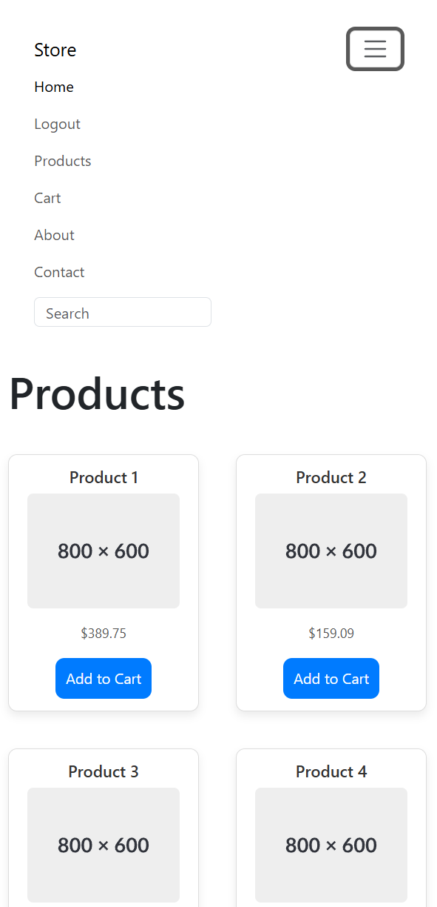
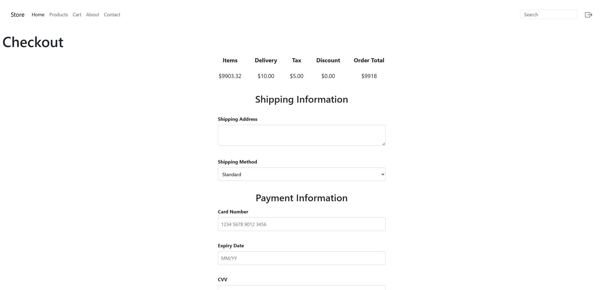
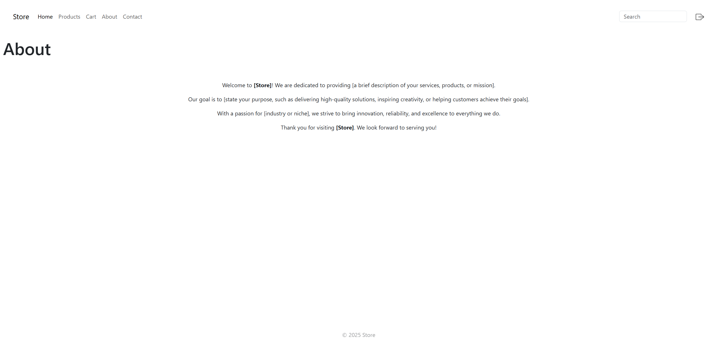

# Store

- This project replicates an online store experience, allowing users to browse products, view product details, manage cart contents, and handle account login and registration.

## Features
- Product Grid View
- Product Details View
- Product Search Functionality
- Register User
- Login/Logout User
- Forgot Password Functionality
- Add Products to Cart (Custom Quantity)
- Cart Overview
- Checkout Functionality (Missing Actual Payment/Shipping Process)










## Prerequisites:
- Python 3.13+
- PostgreSQL
- `pip`

## Installation
You can set up the **Store** in two ways: using **Git** or **Docker**.

## How to Use with Git

### 1. Clone the Repository
```bash
git clone https://github.com/lllDavid/store
```

### 2. Install dependencies
**Navigate to the directory:**
```bash
cd store
```

**Create a virtual environment:**
```bash
python -m venv venv
```


**Activate the virtual environment:**
```bash
.\venv\Scripts\activate
```


**Install requirements:**
```bash
pip install -r requirements.txt
```

### 3. Setup PostgreSQL
**Download and install PostgreSQL from their official site:** [PostgreSQL](https://www.postgresql.org/download/)

Add PostgreSQL to **PATH** environment variable

### 4. Connect to Database

**Login to PostgreSQL Session**
```bash
psql -U postgres
```
### 5. Create Database 
```text
CREATE DATABASE store_db;
```
- Exact **DB Config** is located in: store/settings.py

### 6. Apply Database migrations
```bash
python manage.py migrate
```
### 7. Run the Application
```bash
python manage.py runserver

```
### This will start the App at: [http://127.0.0.1:8000](http://127.0.0.1:8000)

## How to Use with Docker

#### Prerequisites
- [Docker Desktop](https://www.docker.com/products/docker-desktop/)

### 1. Clone the Repository

```bash
git clone https://github.com/lllDavid/store
```
### 2. **Navigate to the directory:**
```bash
cd store
```
### 3. Build and run the Container

```bash
docker-compose up 
```
### This will start the App at: [http://127.0.0.1:8000](http://127.0.0.1:8000)

# Products
- The Products database is empty at the start.

### 1. Create a Superuser Account
You can create a superuser account to add your own products manually:
```bash
python manage.py createsuperuser # regular environment
```
```bash
docker exec -it store-app-1 python manage.py createsuperuser # Docker environment
```
### 2. Generate Random Products
Alternatively, generate a specified number of random products:
```bash
python manage.py create_products <n> # regular environment
```
```bash
docker exec -it store-app-1 python manage.py create_products <n> # Docker environment
```